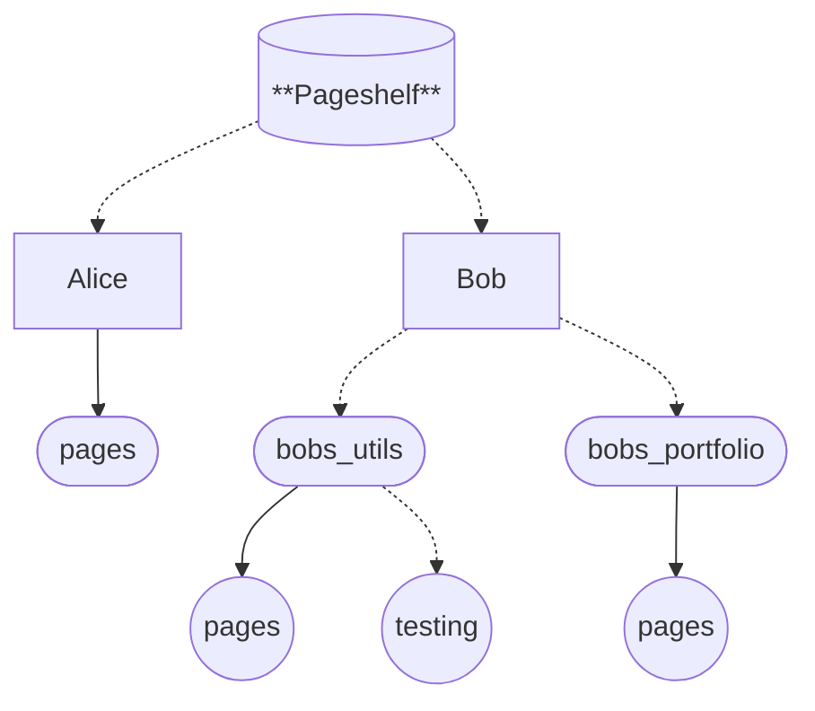

# Architecture

## Table of Contents

- [Architecture](#architecture)
  - [Table of Contents](#table-of-contents)
  - [Terminology](#terminology)
  - [Model](#model)
    - [Pages](#pages)
  - [Source Map](#source-map)
    - [`src/backend`](#srcbackend)
    - [`src/frontend`](#srcfrontend)

## Terminology

- Owner: A user, who is able to create Pages.
- Page: A user-created site, composed of Assets that can be queried.
- Branch: A specific variant of a Page. This is optional to specify.
- Asset: A block of data identified via a path.
- Domain: A custom domain that can alias a specific Page.

## Model

### Pages

Assume we have two users, Alice and bob, and assume `pages` is the default Branch and Page name if one is not specified. The dotted lines require specificity, and solid shows where things will automatically reference:

It's an Owner -> Page -> Branch relation. 
This shows the structure of information needed when accessing a page.

## Source Map

### `src/backend`

This implements and exposes utilities for getting Pages and Assets from various sources, as well as layers to alter how they're accessed.

This includes presently;

- In-Memory
- Forgejo (Direct Raw-Access)
- Redis (Caching)

### `src/frontend`

This implements an Actix frontend for serving data from the backend in a human-readable format. It also includes [MiniJinja](https://docs.rs/minijinja/latest/minijinja/) templates for creating system pages, such as the index or error pages.
