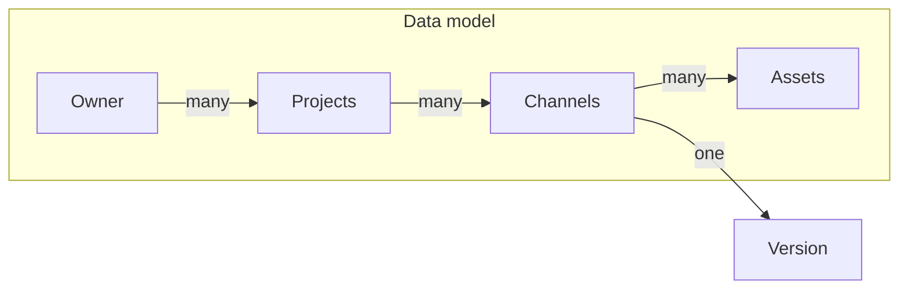
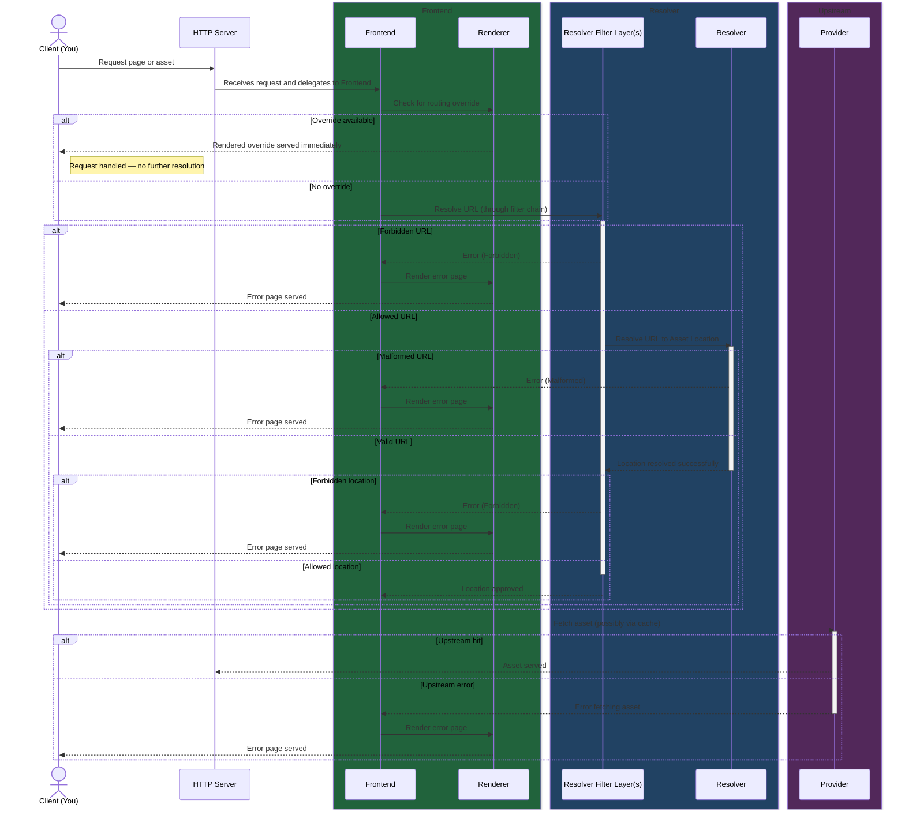

# Pageshelf - Architecture Overview

## Repository layout (top-level)

- `crates/`
  - `core/` — core library: types and logic for resolution, caching, upstream adapters, transformations, and general backend utilities. This crate contains the core data model (pages, assets, locations, resolvers, cache interfaces) and is heavily unit tested.
  - `test-utils/` — testing helpers used by integration tests across crates.
  - `frontend/` — frontend helpers used by the web server (rendering helpers, templates, response builders).
  - `providers/` — provider adapters (e.g. `upstream-forgejo`) that implement upstream access to source code hosting services or other backends.
  - `web/` — web server crate which wires Actix (or another HTTP framework) to the `crates/*` libraries to serve pages and assets over HTTP. Contains actix-specific layers and handlers.
- `example/` — example configuration files and auxiliary scripts used to demonstrate or run a local instance.
- `src/` — application entry points and CLI: binary code that uses the crates above to provide `pageshelf` command line tooling (serve, check, cache operations, etc.).
- `target/`, `Cargo.toml`, `rust-toolchain.toml`, etc. — standard Rust build artifacts and configuration.

## Key concepts and components

- Page model
  - Owner: an account that owns one or more projects/pages.
  - Project: a repository or site. An Owner has many Projects.
  - Channel: variant of a Project. A Project has many Channels.
  - Asset: an item identified by a path within a Channel. A Channel has many Assets, but each Asset has one canonical version in the system (i.e., channels track a single current version of an asset).

- Resolver
  - Implementations of `PageResolver` (e.g. directory resolver) accept a URL and map it to an `AssetLocation` / `PageLocation` (owner/project/channel/path). Filters can wrap a resolver to apply access control.

- Upstreams & Providers
  - An upstream provides implementations to fetch pages and assets from external sources (forgejo, git hosting, filesystem, etc.). Providers live in `providers/` and implement the adapter interfaces expected by `crates/core`.

- Cache layers
  - Cache abstractions live in `crates/core` (cache interfaces, kv adapters); higher-level services use Redis or other backends to speed up repeated fetches.

- Frontend
  - `crates/frontend` and `web/` compose templating, response formatting, and HTTP handlers. Templates for system pages live with the frontend crate.

### Data model

```mermaid
flowchart LR
    Owner["Owner"] -- many --> Projects["Projects"]
    Projects -- many --> Channels["Channels"]
    Channels -- many --> Assets["Assets"]
    Channels -- one --> Version["Version"]
    subgraph model[Data model]
      Owner
      Projects
      Channels
      Assets
    end
```

## How the pieces interact (Default request flow)

1. **`WebServer` recieves a request** and delegates to `Frontend`
2. **`Frontend` recieves** the request and begins processing it
3. **`Frontend` checks for a routing override** from the `Renderer`
   - If available, it will be served instead - otherwise it continues to the next steps
4. **`Frontend` resolves the URL** via the `PageResolver`
   1. URL is filtered for access control
   2. URL is then decoded into an `AssetLocation`
   3. `AssetLocation` is then filtered again for access control
5. **`Frontend` requests the asset** via the `Upstream`
6. **`Frontend` responds with the asset**, which is then served by the `WebServer`
7. **Errors at any point** will cause an error page to be rendered by `Renderer` and served instead.

This behavior can be overridden; Everything is a trait, so you can roll your own `Frontend`, etc if you wish.

### Sequence graph

```mermaid
sequenceDiagram
  %% === Actors & Participants ===
  actor CLIENT as Client (You)
  participant WEB as HTTP Server

  box rgba(33, 99, 60, 1) Frontend
    participant FRONT as Frontend
    participant RENDER as Renderer
  end

  box rgb(33,66,99) Resolver
    participant FILTER as Resolver Filter Layer(s)
    participant RESOLVER as Resolver
  end

  box rgba(82, 40, 90, 1) Upstream
    participant PROVIDER as Provider
  end

  %% === Main Request Flow ===
  CLIENT->>WEB: Request page or asset
  WEB->>FRONT: Receives request and delegates to Frontend

  FRONT->>RENDER: Check for routing override
  alt Override available
    RENDER-->>CLIENT: Rendered override served immediately
    note right of CLIENT: Request handled — no further resolution
  else No override
    FRONT->>FILTER: Resolve URL (through filter chain)
  end

  %% === URL Filtering & Resolution ===
  activate FILTER
  alt Forbidden URL
    FILTER-->>FRONT: Error (Forbidden)
    FRONT->>RENDER: Render error page
    RENDER-->>CLIENT: Error page served

  else Allowed URL
  
    FILTER->>RESOLVER: Resolve URL to Asset Location
    activate RESOLVER

    alt Malformed URL
      RESOLVER-->>FRONT: Error (Malformed)
      FRONT->>RENDER: Render error page
      RENDER-->>CLIENT: Error page served
    else Valid URL
      RESOLVER-->>FILTER: Location resolved successfully
      deactivate RESOLVER
      

      alt Forbidden location
        FILTER-->>FRONT: Error (Forbidden)
        FRONT->>RENDER: Render error page
        
        RENDER-->>CLIENT: Error page served
      else Allowed location
        deactivate FILTER
        FILTER-->>FRONT: Location approved
      end
    end
  end

  %% === Asset Fetching ===
  FRONT->>PROVIDER: Fetch asset (possibly via cache)
  activate PROVIDER

  alt Upstream hit
    PROVIDER-->>WEB: Asset served
  else Upstream error
    PROVIDER-->>FRONT: Error fetching asset
    deactivate PROVIDER
    FRONT->>RENDER: Render error page
    RENDER-->>CLIENT: Error page served
  end
```

## Tests and verification

- Unit and integration tests are primarily co-located in the crate that owns the code. Many critical behaviors (resolvers, compression, cache, etc.) have unit tests under each crate.

## Useful files

- `Cargo.toml` — workspace manifest
- `crates/core/Cargo.toml` — core crate
- `crates/frontend/Cargo.toml` — frontend helpers
- `web/Cargo.toml` — web server crate
- `example/config.toml` — example configuration used by local runs
